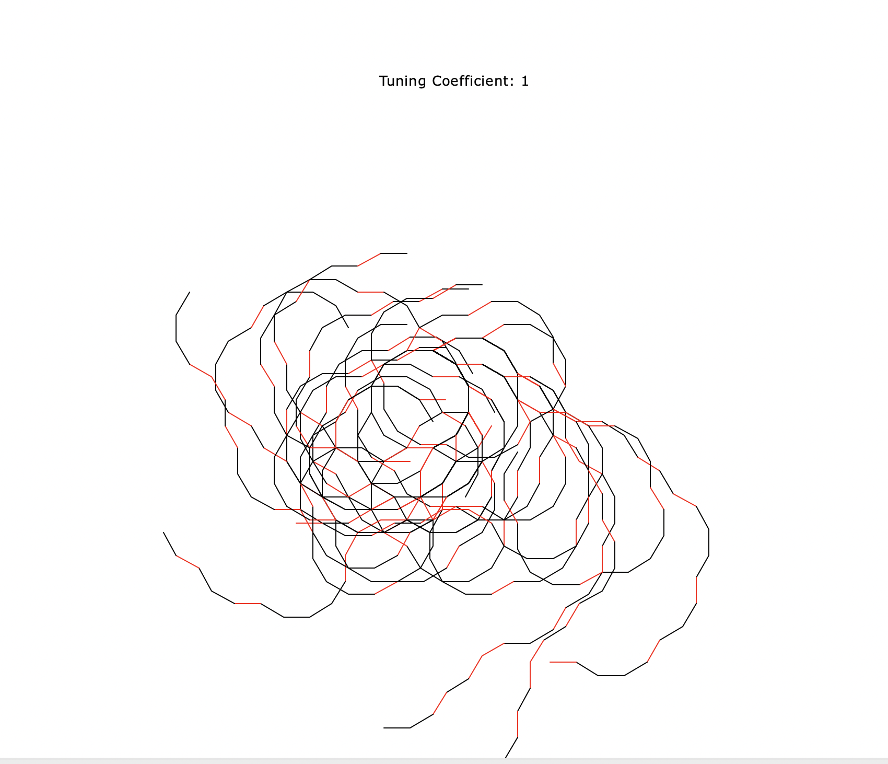

# *The Road Less Turtled*

* AUTHOR: Evan Albers
* DUE DATE: 15 September 2022
* PROJECT: M3 - The Road Less Turtled

****

## Setup
The setup is fairly straightforward. To run *The Road Less Turtled*, simply open a terminal window and run a command line command of the form `python3 M3.py [x]` where x is an int greater than one. A window will pop up, and a legion of turtles will go to work. Simply quit the process when satisfied with their work.  

***

## Artistic Context
One of my favorite poems is "The Road Not Taken" by Robert Frost. Especially throughout my college years, where I've made a series of decisions that will probably play out across my whole life (major, internship decisions, etc.), it is easy to think about choices not made,
and dwell on where they might have lead. In particular, I think about making choices that are against the grain of what others have typically done; one example is how I've spent most of my summers rowing, instead of finding work. I'm fortunate to be able to do it in the first place, but it represents a bit of a risk, especially if it means other future oppurtunities might suffer for a lack of a more productive use of that time. Despite this, I don't regret it. There is a passage in "The Road Not Taken" that speaks to me in this light:

> Two roads diverged in a yellow wood,  
> And sorry I could not travel both  
> And be one traveler, long I stood  
> And looked down one as far as I could  
> To where it bent in the undergrowth;
>
>Then took the other, as just as fair,  
>And having perhaps the better claim,  
>Because it was grassy and wanted wear  

With "The Road Less Turtled," I wanted to capture the notion of feeling more likely to take a given path, simply because the other alternative has been far more frequently traveled. I also wanted to visually represent uncertainty in a demonstrable way, and I wanted the output of the program to vary with some controllable level of uncertainty.  

***  

## Overall Structure and Challenges 
One of the key challenges in implementing "The Road Less Turtled" was my 
lack of knowledge surrounding the Markov Chain (MC). One of my chief goals was to finish the project with a more comprehensive grasp of the Markov structure, and to learn how to manipulate it to help achieve what I wanted to achieve. To accomplish the effect of "deciding" between paths to take, I decided on using a 9th order Markov chain, where the previous 8 states influence the current state. Each "decision" represents a choice for the turtle: whether to turn right or left, and continue forward by a constant amount before deciding again. My goal was to represent a series of decisions that resets after the turtle selects "the road less travelled;" as the turtle takes the road more frequently travelled (represented by a right turn), it becomes more likely to divert, and take the road less travelled (represented by a left turn). Upon taking the road less travelled, the cycle restarts, with the turtle becoming more likely to return to the road frequently travelled.  

Representing this structure in a MC was the first challenge I encountered. I was unsure at first how to represent a MC in which only certain outcomes could proceed from a given state. I decided to represent each consecutive right turn as an integer: 1 indicated one right turn, 2 indicated 2 consecutive turns, 3 three turns, and so on until 9. I let 0 represent a left turn. The MC needed to reflect the reality that one cannot jump from 3 consecutive turns to 9, or from 8 to 4, in the course of one turn. I achieved this by setting the probability of jumping to a state that was not n+1 (other than 0), from n, to 0. The other challenge I wanted to tackle was incorporating an element of "tunability;" ie, I wanted to be able to play with the amount of uncertainty in the model parametrically, as I imagine that will be something we explore in greater depth later in this course, and I wanted to try it out.  

Incorporating a parameter into the MC took a little bit of thinking to achieve the effect I wanted. I wanted the parameter to be a measure of "order." The greater the parameter, the less likely the turtles were to deviate from the road frequently turtled. I finally settled on a way to work it in, with some minor additions to make the program robust to user error. If anything is submitted other than an int greater than one, it sets the tuning coefficient to one. The parameter generally works as intended. As the tuning coefficient increases, the sporadic nature of the artwork decreases, and if it is sufficiently large, the drawing converges on a single circle with little or no derivation. This effect can be observed in the example outputs provided below:  

T = 1:  

